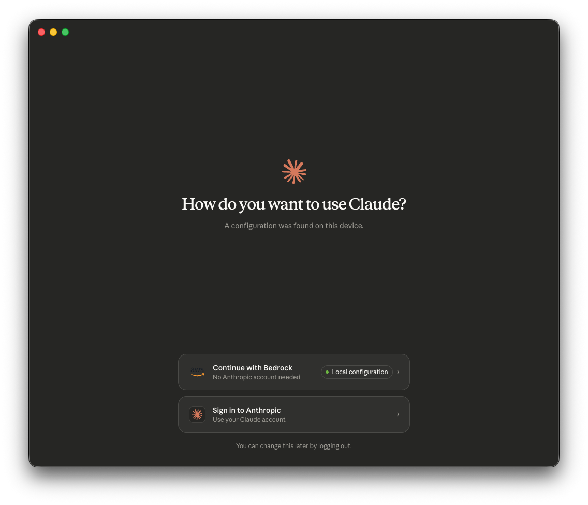

# Claude Cowork with Third-Party Platforms (CoWork 3P)

This guide explains how to use this solution's credential helper with **Claude Cowork** (Claude Desktop) in third-party platform mode, enabling enterprise-managed Claude Desktop deployments that authenticate through your existing identity provider.

## Overview

[Claude Cowork with third-party platforms](https://support.claude.com/en/articles/14680741-install-and-configure-claude-cowork-with-third-party-platforms) allows IT administrators to deploy Claude Desktop with Amazon Bedrock as the inference backend, managed via MDM configuration profiles. Users get core Claude Desktop capabilities including projects, artifacts, memory, file upload/export, remote connectors, skills, plugins, and MCP servers — with consumption-based pricing through your existing AWS billing (no Anthropic seat licensing).

> **Note:** Features that require Anthropic-hosted inference — including the Chat tab, Computer Use, and the Skills Marketplace — are not available in third-party platform mode. See the [Feature Matrix](https://claude.com/docs/cowork/3p/feature-matrix) for a full comparison.

**Key insight:** The same `credential-process` helper that this solution provides for Claude Code CLI also works as the `inferenceCredentialHelper` for Claude Cowork 3P. This means a single deployment covers both:

- **Claude Code** (terminal-based coding tool for developers)
- **Claude Cowork** (Claude Desktop for knowledge workers — product managers, analysts, operations teams)

No additional AWS infrastructure is required — if you've already deployed this solution for Claude Code, you can extend it to Claude Cowork immediately. Your data stays within your AWS account: Amazon Bedrock does not store prompts, files, tool inputs/outputs, or model responses.

### Architecture

The following diagram from the [AWS Blog](https://aws.amazon.com/blogs/machine-learning/from-developer-desks-to-the-whole-organization-running-claude-cowork-in-amazon-bedrock/) illustrates the end-to-end flow for Claude Cowork with Amazon Bedrock:


The application has three outbound paths: model inference to Amazon Bedrock in your configured regions, MCP server connections to endpoints you approve, and optional aggregate telemetry to Anthropic (which can be disabled).

## Prerequisites

Before configuring Claude Cowork 3P, ensure:

1. **This solution is deployed** — Follow the [Quick Start Guide](../../QUICK_START.md) to deploy authentication infrastructure
2. **Users have the credential-process installed** — Distribute via `ccwb package` as described in [Step 4 of Quick Start](../../QUICK_START.md#step-4-create-distribution-package)
3. **Claude Desktop is installed** — Download from [claude.com/download](https://claude.com/download)
4. **MDM solution available** — For deploying configuration profiles to managed devices

## Getting Started

The workflow depends on whether you've already deployed this solution for Claude Code:

**Existing deployments** (already ran `ccwb init` + `ccwb deploy`):
1. Run `ccwb cowork generate` to create MDM configuration files
2. Deploy the generated files to managed devices via your MDM solution
3. Distribute the `credential-process` binary to users (if not already done)

**New deployments** (starting from scratch):
1. Follow the [Quick Start Guide](../../QUICK_START.md) to deploy authentication infrastructure
2. Run `ccwb package` to build distribution packages — CoWork 3P configs are auto-generated alongside
3. Deploy MDM configuration files and distribute packages to users

## Configuration

There are three ways to create the MDM configuration. **Option 1 (CLI)** is recommended as it auto-generates from your deployment profile.

### Option 1: Generate via CLI (Recommended)

If you've deployed this solution, the `ccwb cowork generate` command auto-generates MDM configuration files from your existing deployment profile — no manual JSON editing required:

```bash
# Generate all formats (JSON, macOS .mobileconfig, Windows .reg)
poetry run ccwb cowork generate

# Generate only macOS profile
poetry run ccwb cowork generate --format mobileconfig

# Custom model list
poetry run ccwb cowork generate --models opus,sonnet,haiku

# Specific deployment profile
poetry run ccwb cowork generate --profile Production
```

Generated files are saved to `dist/cowork-3p/` by default. See [CLI Reference](CLI_REFERENCE.md#cowork-generate---generate-mdm-configuration) for all options.

CoWork 3P configs are also auto-generated alongside distribution packages during `ccwb package` when enabled via `ccwb init`.

### Option 2: Configure via Setup UI

Claude Desktop includes a built-in configuration interface for third-party inference. Once the credential-process is installed on the user's machine, you can configure it visually:

1. Open Claude Desktop
2. Navigate to **Menu Bar → Help → Troubleshooting → Enable Developer mode**
3. Go to **Developer → Configure third-party inference**
4. Select **Bedrock** as the inference provider


In the **Bedrock Credentials** section, configure:
- **AWS region**: Your Bedrock region (e.g., `us-west-2`)
- **AWS profile name**: The profile configured during `ccwb init` (e.g., `ClaudeCode`)
- **Credential helper**: Path to this solution's binary — `~/claude-code-with-bedrock/credential-process --profile ClaudeCode`

In the **Identity & Models** section:
- **Model list**: Add the model aliases your organization has enabled (e.g., `opus`, `sonnet`, `opusplan`)

Once configured, use **Export** to generate a `.mobileconfig` (macOS) or `.reg` (Windows) file for MDM distribution, or **Apply locally** for immediate testing.

After applying the configuration, Claude Desktop will detect the Bedrock setup and present the option to continue:



Select **Continue with Bedrock** to start using Claude with your organization's credentials.

### Option 3: JSON MDM Configuration

For automated deployment at scale, create an MDM profile with the following essential keys:

```json
{
  "inferenceProvider": "bedrock",
  "inferenceBedrockRegion": "us-west-2",
  "inferenceModels": [
    "us.anthropic.claude-opus-4-7",
    "us.anthropic.claude-sonnet-4-6",
    "us.anthropic.claude-haiku-4-5-20251001-v1:0"
  ],
  "inferenceCredentialHelper": "~/claude-code-with-bedrock/credential-process --profile ClaudeCode",
  "inferenceCredentialHelperTtlSec": 3600
}
```

> **Note:** See the [Configuration Reference](#configuration-reference) below for the full set of optional MDM keys (telemetry, extensions, auto-updates, workspace caps, etc.).

### Key Configuration Fields

| Key | Description |
|-----|-------------|
| `inferenceProvider` | Must be set to `"bedrock"` to activate third-party platform mode with Amazon Bedrock |
| `inferenceCredentialHelper` | **The connection point** — path to this solution's `credential-process` binary with the `--profile` flag matching the profile name configured during `ccwb init` |
| `inferenceCredentialHelperTtlSec` | How long (seconds) to cache credential helper output before re-invoking. Default: `3600` (1 hour) |
| `inferenceBedrockRegion` | AWS region for Bedrock API calls (e.g., `us-west-2`, `us-east-1`) |
| `inferenceBedrockProfile` | AWS named profile from `~/.aws/config` used by the credential helper |
| `inferenceBedrockAwsDir` | Path to the directory containing AWS config/credentials files (default: `~/.aws`) |
| `inferenceModels` | JSON array of model identifiers available to users. Supports full CRIS model IDs (e.g., `us.anthropic.claude-opus-4-7`) or simple aliases (`opus`, `sonnet`, `haiku`). First entry is the default |

> **Note:** The `ccwb cowork generate` command automatically resolves the selected model and cross-region profile to full CRIS model IDs for `inferenceModels`. This ensures CoWork uses the exact same model and region routing as Claude Code. Use `--models` to override with custom model IDs or aliases.

### How the Credential Helper Works

When Claude Cowork starts a session:

1. Claude Desktop invokes the `inferenceCredentialHelper` command
2. The `credential-process` binary authenticates the user via your OIDC provider (Okta, Azure AD, Auth0, etc.)
3. Temporary AWS credentials are returned with Bedrock access
4. Claude Desktop uses these credentials for inference API calls
5. Credentials are cached for `inferenceCredentialHelperTtlSec` seconds before re-invoking

This is the same authentication flow used by Claude Code CLI — the credential-process handles OIDC federation, token exchange, and AWS STS credential retrieval transparently.

## Deployment

### macOS (MDM Configuration Profile)

1. Create the MDM configuration JSON with your settings
2. Export as a `.mobileconfig` file or use Claude Desktop's built-in setup UI:
   - Open Claude Desktop → Menu Bar → Help → Troubleshooting → Enable Developer mode
   - Developer → Configure third-party inference
   - Configure fields and export the `.mobileconfig`
3. Deploy via your MDM solution (Jamf, Kandji, Mosyle, etc.)

### Windows (Registry)

1. Create the MDM configuration JSON with your settings
2. Export as a `.reg` file via the Claude Desktop setup UI, or create registry entries manually
3. Deploy via Group Policy, Intune, or your MDM solution

### VDI Environments

In VDI deployments, either:
- Set MDM keys in the golden image so every cloned session inherits them
- Push keys at runtime through your VDI broker's policy system

Ensure the `credential-process` binary is included in the VDI image at the path specified in `inferenceCredentialHelper`.

## Configuration Reference

The full set of MDM configuration keys is documented in the [official Anthropic guide](https://support.claude.com/en/articles/14680741-install-and-configure-claude-cowork-with-third-party-platforms). Below is a summary of the most relevant categories.

### Inference Settings

| Key | Type | Description |
|-----|------|-------------|
| `inferenceProvider` | string | Selects inference backend. Set to `bedrock` for Amazon Bedrock |
| `inferenceBedrockRegion` | string | AWS region for Bedrock |
| `inferenceBedrockProfile` | string | AWS named profile from `~/.aws/config` |
| `inferenceBedrockAwsDir` | string | Path to AWS config directory |
| `inferenceBedrockBaseUrl` | string | Override Bedrock endpoint (e.g., VPC interface endpoint) |
| `inferenceBedrockBearerToken` | string | AWS bearer token (alternative to credential helper) |
| `inferenceModels` | string | JSON-encoded array of model aliases (e.g., `"[\"opus\", \"sonnet\"]"`) |
| `inferenceCredentialHelper` | string | Path to credential helper executable |
| `inferenceCredentialHelperTtlSec` | integer | Cache TTL for credential helper output (default: 3600) |

> **Note:** Array-typed MDM keys (such as `inferenceModels`, `managedMcpServers`, `allowedWorkspaceFolders`) are delivered as **JSON-encoded strings** — the value is a string containing a JSON array, not a native array. For example, `inferenceModels` is set to `"[\"opus\", \"sonnet\"]"`, not `["opus", "sonnet"]`. The Claude Desktop Setup UI and the `.mobileconfig`/`.reg` export handle this encoding automatically.

### Deployment and Updates

| Key | Type | Description |
|-----|------|-------------|
| `deploymentOrganizationUuid` | string | Stable UUID identifying this deployment |
| `disableDeploymentModeChooser` | boolean | Hide the deployment mode chooser UI |
| `disableAutoUpdates` | boolean | Block automatic update checks and downloads |
| `autoUpdaterEnforcementHours` | integer | Force pending update after this many hours |

### MCP, Plugins, and Tools

| Key | Type | Description |
|-----|------|-------------|
| `isClaudeCodeForDesktopEnabled` | boolean | Show the Code tab (terminal coding sessions) |
| `isDesktopExtensionEnabled` | boolean | Permit local desktop extension installation |
| `isDesktopExtensionDirectoryEnabled` | boolean | Show the Anthropic extension directory |
| `isDesktopExtensionSignatureRequired` | boolean | Require signed desktop extensions |
| `isLocalDevMcpEnabled` | boolean | Permit user-added local MCP servers |
| `managedMcpServers` | string | JSON array of managed MCP server configs |
| `disabledBuiltinTools` | string | JSON array of tool names to disable |

### Telemetry

| Key | Type | Description |
|-----|------|-------------|
| `disableEssentialTelemetry` | boolean | Block crash/error reports and performance data |
| `disableNonessentialTelemetry` | boolean | Block product usage analytics |
| `disableNonessentialServices` | boolean | Block connector favicons and artifact preview |
| `otlpEndpoint` | string | OTLP collector URL for observability export |
| `otlpProtocol` | string | OTLP protocol (`http/protobuf`, `http/json`, or `grpc`) |
| `otlpHeaders` | string | Headers for OTLP requests |

### Workspace and Usage Caps

| Key | Type | Description |
|-----|------|-------------|
| `allowedWorkspaceFolders` | string | JSON array of allowed workspace folder paths |
| `inferenceMaxTokensPerWindow` | integer | Token cap per tumbling window |
| `inferenceTokenWindowHours` | integer | Tumbling window length in hours (max 720) |

## Verification

After deploying the MDM profile:

1. Launch Claude Desktop on a test machine
2. Verify you see the third-party platform mode indicator (no login prompt for claude.ai)
3. Start a conversation — Claude should respond using Bedrock inference
4. Check that the credential helper authenticates correctly (user may see an SSO browser prompt on first use)

If users see an error at launch, verify:
- The `inferenceProvider` key is set to `bedrock`
- The `inferenceCredentialHelper` path is correct and the binary exists
- The `--profile` flag matches a profile configured during `ccwb init`
- The user has completed at least one authentication via `credential-process` (to establish the initial SSO session)

## Monitoring

The `ccwb cowork generate` command automatically includes `otlpEndpoint` in the generated MDM config when a monitoring stack is deployed. This points Claude Cowork at the same OpenTelemetry collector used by Claude Code.

However, the telemetry emitted by Claude Cowork is **different from Claude Code's OTEL metrics**:

- **Claude Code** emits fine-grained metrics (token consumption, cache hit rates, lines of code written/accepted, file operations, programming language distribution) that populate this solution's CloudWatch dashboards
- **Claude Cowork** exports higher-level session events (prompts, tool access, file access patterns) designed for security monitoring and incident investigation

The collector will receive Cowork events, but the **CloudWatch dashboards deployed by this solution will not display them** — the dashboard widgets are built for Claude Code's specific metric schema. To visualize Cowork telemetry, you can:

- Query the raw OTLP data in CloudWatch Logs directly
- Route Cowork events to a separate SIEM or observability platform (Datadog, Splunk, Elastic) by configuring a different `otlpEndpoint`:

```json
{
  "otlpEndpoint": "https://your-otel-collector.example.com",
  "otlpProtocol": "http/protobuf"
}
```

See [Monitor Claude Cowork activity with OpenTelemetry](https://support.claude.com/en/articles/14477985-monitor-claude-cowork-activity-with-opentelemetry) for details on the event schema and supported destinations.

## Additional Resources

- [AWS Blog: From Developer Desks to the Whole Organization — Running Claude Cowork in Amazon Bedrock](https://aws.amazon.com/blogs/machine-learning/from-developer-desks-to-the-whole-organization-running-claude-cowork-in-amazon-bedrock/)
- [Official Anthropic Guide: Install and Configure Claude Cowork with Third-Party Platforms](https://support.claude.com/en/articles/14680741-install-and-configure-claude-cowork-with-third-party-platforms)
- [Claude Cowork 3P Configuration Reference](https://claude.com/docs/cowork/3p/configuration)
- [Claude Cowork 3P Feature Matrix](https://claude.com/docs/cowork/3p/feature-matrix)
- [Claude Cowork with Third-Party Platforms Overview](https://support.claude.com/en/articles/14680729-use-claude-cowork-with-third-party-platforms)
- [Extend Claude Cowork with Third-Party Platforms](https://support.claude.com/en/articles/14680753-extend-claude-cowork-with-third-party-platforms)
- [Quick Start Guide](../../QUICK_START.md) — Deploy the authentication infrastructure
- [Monitoring Guide](MONITORING.md) — OpenTelemetry monitoring setup
